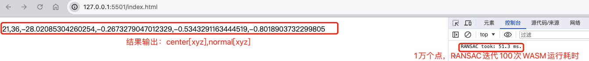

# 简介
这是一个学习C++与网页端进行联合编程的尝试，使用WASM将C++编译成js可调用的模块。从而使耗时的算法用底层C++实现，通过WASM二进制格式文件在网页端执行，提高效率。

本项目是一个完整的使用WASM技术，将C++与js联合编程的完美Demo，可以参考此项目进行改造，创建你自己的项目。

## 项目内容

在网页端实现，在一堆3D点中，使用RANSAC进行平面提取的过程，网页端生成模拟3D点，传入C++层进行平面提取，返回平面的参数[center[xyz], normal[xyz]]


# WASM 学习资料

**WASM的常规中文教程：**

- WASM中文网：https://wasmdev.cn/guide/introduction/what-is-webassembly.html 
- MDN的WASM教程：https://developer.mozilla.org/zh-CN/docs/WebAssembly/Concepts 
- Emscripten官方文档：[Emscripten](https://emscripten.org/docs/introducing_emscripten/index.html)
- 掘金：[20分钟上手 webAssembly](https://juejin.cn/post/6844903661982728200)


**实战参考**

- CMake与Emscripten联合编译实践：https://stunlock.gg/posts/emscripten_with_cmake/  
- wasm的模版：https://github.com/TheLartians/modern-wasm-starter

# 使用教程
- 首先安装Emscripten， 在mac端直接`brew install emscripten`，或者参考[官方教程](https://emscripten.org/docs/getting_started/downloads.html#installation-instructions-using-the-emsdk-recommended)
  - 安装完成后测试：`emcc -v` 正确显示版本号，则安装成功
  
- 编译
    ```
    mkdir build
    cd build
    emcmake cmake ..
    make -j
    ```

- 创建测试环境
  - 我是在VSCode中使用的，直接安装插件：Live Server。
  - 然后打开index.html, 点击VSCode右下角 `Go Live` 运行Live Server插件，然后在默认浏览器就可以看到运行情况了。
    
    


# 感谢
3D Plane fitting is based on https://github.com/YihuanL/PlaneFitting

3D Plane fitting using RANSAC method modified according to https://github.com/drsrinathsridhar/GRANSAC.

GRANSAC is released under an MIT License. 
 

